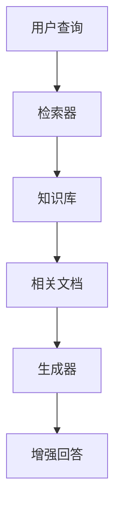

# 📚 RAG技术

## 🎯 概述
RAG (Retrieval-Augmented Generation) 通过检索外部知识增强大模型能力，解决知识时效性和幻觉问题。

## 🏗️ RAG架构

### 1️⃣ 基础RAG流程


### 2️⃣ 核心组件
- **检索器**：Dense Passage Retrieval、ColBERT
- **生成器**：大语言模型
- **知识库**：向量数据库、文档存储

## 🏗️ 检索技术

### 1️⃣ 密集检索
- **DPR**：双编码器架构
- **Contriever**：无监督预训练
- **ColBERT**：延迟交互模型

### 2️⃣ 混合检索
- **稠密+稀疏**：结合向量检索和关键词检索
- **重排序**：交叉编码器精排
- **多路召回**：提高召回率

## 📊 向量数据库对比
| 数据库 | 特点 | 性能 | 适用场景 |
|---|---|---|---|
| **FAISS** | 高效相似度搜索 | 高 | 研究原型 |
| **Pinecone** | 托管服务 | 高 | 生产环境 |
| **Weaviate** | 图数据库 | 中 | 复杂关系 |
| **Milvus** | 分布式 | 高 | 大规模数据 |

## 🎯 实战代码
```python
from langchain.vectorstores import FAISS
from langchain.embeddings import HuggingFaceEmbeddings
from langchain.text_splitter import RecursiveCharacterTextSplitter

# 初始化组件
embeddings = HuggingFaceEmbeddings(model_name="sentence-transformers/all-MiniLM-L6-v2")
text_splitter = RecursiveCharacterTextSplitter(chunk_size=1000, chunk_overlap=200)

# 构建知识库
documents = text_splitter.split_documents(raw_documents)
vectorstore = FAISS.from_documents(documents, embeddings)

# 检索增强
retriever = vectorstore.as_retriever(search_kwargs={"k": 3})
qa_chain = RetrievalQA.from_chain_type(
    llm=llm,
    chain_type="stuff",
    retriever=retriever
)
```

## 🎯 面试重点
1. **RAG如何解决幻觉问题？**
2. **稠密检索vs稀疏检索的区别？**
3. **如何评估RAG系统的效果？**
4. **RAG的局限性和改进方向？**