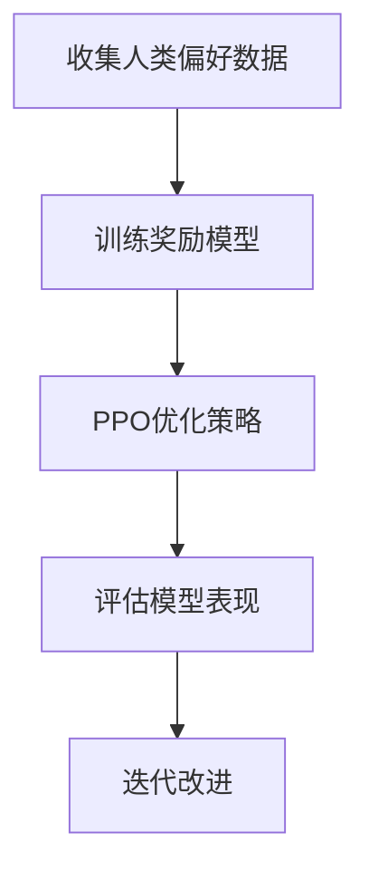

# 🎮 强化学习

## 🎯 概述
强化学习(RL)在大模型中主要用于对齐训练，使模型行为符合人类价值观和偏好。

## 🏗️ 核心算法
### 1️⃣ DPO (Deep Policy Optimization)
- **原理**：简化RLHF流程，直接优化策略
- **公式**：$L^{CLIP}(\theta) = \mathbb{E}_t[\min(r_t(\theta)\hat{A}_t, \text{clip}(r_t(\theta), 1-\epsilon, 1+\epsilon)\hat{A}_t)]$
- **应用**：SFT

### 1️⃣ PPO (Proximal Policy Optimization)
- **原理**：限制策略更新幅度，防止训练不稳定
- **公式**：$L^{CLIP}(\theta) = \mathbb{E}_t[\min(r_t(\theta)\hat{A}_t, \text{clip}(r_t(\theta), 1-\epsilon, 1+\epsilon)\hat{A}_t)]$
- **应用**：ChatGPT、InstructGPT

### 2️⃣ RLHF流程

### GRPO
### 3️⃣ 奖励模型训练
- **输入**：(prompt, response1, response2, preference)
- **目标**：学习人类偏好函数$r(x,y)$
- **损失函数**：$\text{loss} = -\log(\sigma(r(x,y_w) - r(x,y_l)))$

## 📊 技术对比
| 方法 | 稳定性 | 样本效率 | 计算成本 | 应用 |
|---|---|---|---|---|
| **PPO** | 高 | 中 | 高 | ChatGPT |
| **DPO** | 中 | 高 | 低 | 简化RLHF |
| **RRHF** | 高 | 高 | 中 | 排名优化 |

## 🎯 面试重点
1. **RLHF的三个阶段是什么？**
2. **PPO如何防止策略崩溃？**
3. **奖励模型的训练目标？**
4. **RLHF与SFT的区别？**